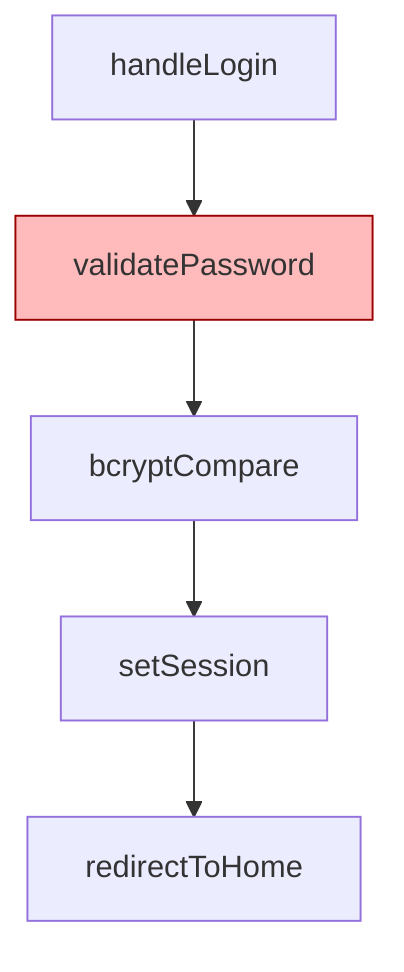

# Flow Diagram in PR Review — v0.3.1

Add a dedicated synthesis step that asks a cheap LLM to produce a Mermaid `flowchart TD` summarizing what the bot understood about the PR's code paths. Embed in the PR review summary as a collapsed `<details>` block so reviewer + author can verify the bot's interpretation in one glance.

## Context

- **v0.3.0** ships INTENT injection + graph bridge → bot has rich context (PR meta, classified specs, IMPACT GRAPH per file)
- **v0.3.1 (this plan)** — surface that understanding visually. Closes the "did the bot grok the flow?" verification gap before a human even reads the bug list.
- **Smoke test already done** (Phase 0 of brainstorm session 13:53 ICT): both `gpt-5.4-mini` and `kimi-k2.5` on `ai-proxy.cyberk.io` produce valid Mermaid. Surprise finding: `gpt-5.4-mini` is **7-8x cheaper + 1.7x faster** than kimi on this proxy due to injected context overhead in kimi calls. Default model = `gpt-5.4-mini`, swap-able via env.

## Phases

| # | File | Scope | Effort | Deps |
|---|------|-------|--------|------|
| 1 | [phase-01-flow-diagram-module.md](./phase-01-flow-diagram-module.md) | `flow-diagram.ts` — synthesizeFlowDiagram + Mermaid validation | S | — |
| 2 | [phase-02-wire-step-and-comment.md](./phase-02-wire-step-and-comment.md) | Step 7.5 in agent-loop + `<details>` block in pr-comments | S | 1 |
| 3 | [phase-03-tests.md](./phase-03-tests.md) | Unit (validator + prompt builder) + comment integration | S | 1, 2 |
| 4 | [phase-04-docs.md](./phase-04-docs.md) | README addendum, action.yml input, changeset (**patch** bump) | S | 3 |
| 5 | [phase-05-release-v0.3.1.md](./phase-05-release-v0.3.1.md) | Wait for changeset workflow Version PR; merge | S | 4 |

**Effort legend**: S=<2h, M=2-6h, L=>6h
**Total estimate**: ~3-4h end-to-end.

## Dependencies

```
1 ──> 2 ──> 3 ──> 4 ──> 5
```

Sequential. Each phase has hard typecheck + test gate.

## Key Files (touchpoints)

**New:**
- `src/agent/flow-diagram.ts` — synthesizer + validator (~120 LOC)
- `src/__tests__/flow-diagram.test.ts` — validator + prompt-builder tests
- `.changeset/flow-diagram.md` — patch bump v0.3.0 → v0.3.1

**Modified:**
- `src/agent/agent-loop.ts` — add Step 7.5 (after judge, before filter); pass diagram into a NEW return field
- `src/utils/mock-fleet.ts` — extend `FleetResult` type with `flowDiagram?: string` (or wherever bug pipeline result is shaped)
- `src/github/pr-comments.ts` — `buildReviewSummary()` accepts optional `flowDiagram`; prepend `<details>` block when present
- `src/github/action-entry.ts` — thread diagram into `postPrReview`
- `action.yml` — new input `flow-diagram-enabled: 'true'`
- `README.md` — `### Flow diagram (since v0.3.1)` subsection inside Intent Injection

**Untouched (intentional):**
- ❌ `analyzer-prompt.ts`, `deep-analyzer.ts` — diagram is OUT-of-band, not part of analyzer prompt
- ❌ `services/ai-client.ts` — reuse env-mutation pattern (KISS, even though dirty); refactor to per-call options DEFERRED to separate plan
- ❌ Any per-file diagram logic — single PR-level diagram only

## Env Config (new)

```env
INTENT_FLOW_DIAGRAM=true             # opt-out switch (default on)
AI_FLOW_MODEL=gpt-5.4-mini           # cheap + fast on cyberk proxy (smoke-test verified)
INTENT_FLOW_MAX_NODES=10             # cap diagram complexity to keep render readable
```

`AI_FLOW_MODEL` reuses existing `AI_API_KEY` + `AI_BASE_URL`. To experiment with `kimi-k2.5` / `glm-5` / `qwen3.5-plus` later, just override the env var — no code change.

## Output Contract

The diagram appears at the **top** of the review summary in a `<details>` block (collapsed by default):

```markdown
<details>
<summary>🤖 Bot's understanding (Mermaid flow)</summary>



> ⚠️ This is the bot's interpretation. Verify against actual code before trusting bug analysis.
</details>
```

Then the existing `## 🔍 Ultrareview Results` table follows.

## Anti-Scope-Creep (NON-NEGOTIABLE)

- ❌ NO multiple diagram types (flowchart TD only, no sequence/class/ER)
- ❌ NO per-file diagrams — 1 per PR review only
- ❌ NO interactive features (zoom/expand/dark-mode)
- ❌ NO svg/png export — Mermaid renders natively in GitHub
- ❌ NO new AI provider — reuse cyberk cliproxy
- ❌ NO refactor of `chat()` signature — defer to separate plan if needed
- ❌ NO breaking changes — diagram is purely additive; `INTENT_FLOW_DIAGRAM=false` fully disables

## Success Criteria

- [ ] All 5 phases complete
- [ ] `INTENT_FLOW_DIAGRAM=false` → behavior identical to v0.3.0 (no extra LLM call, no comment change)
- [ ] Diagram renders correctly on a real GitHub PR (Mermaid native)
- [ ] Validation rejects invalid Mermaid → graceful skip (no broken comment posted)
- [ ] Latency adds ≤10s p95 vs v0.3.0
- [ ] Cost adds ≤$0.001/PR (gpt-5.4-mini default)
- [ ] Zero regression in 216 existing tests
- [ ] v0.3.1 git tag + GH release shipped

## Open Questions

1. **Where exactly to thread diagram into result** — `FleetResult` type extension vs separate side-channel? → Decide in Phase 2.
2. **Should `<details>` be open by default for short PRs (≤3 nodes)?** → No, KISS. Always collapsed.
3. **Should diagram include a small legend (changed/added/removed colors)?** → Future v0.3.2 if user feedback wants. Out of scope now.

## Risk Assessment

| Risk | Likelihood | Mitigation |
|---|---|---|
| LLM hallucinates symbols not in IMPACT GRAPH | Medium | Prompt instructs to use ONLY symbols listed in input; no validation enforcement (would over-engineer) — caveat in `<details>` covers it |
| Mermaid syntax error → render broken | Low-Medium | Regex validate `^flowchart TD` + balanced backticks; on fail, skip diagram |
| Token budget bloat from large IMPACT GRAPH | Medium | Cap input context at 3K chars before sending to flow LLM |
| Latency spike on cyberk proxy | Low | Sequential 1 call, ≤10s budget; skip on timeout |
| Reviewer over-trusts diagram | Medium | Mandatory caveat in `<details>` summary block |
| Cost creep on high-volume repos | Low | $0.0001/call × 1 call/PR = trivial; opt-out flag available |

## Versioning Decision

User instruction: **patch bump (v0.3.0 → v0.3.1)**, not minor.

Rationale: diagram is **opt-in** (env-controlled, default on but harmless if cliproxy/model unavailable → graceful skip). Strict SemVer would call this minor (new functionality). User chose patch for faster ship cycle and to bundle with v0.3.0 testing. Acceptable trade-off; document in CHANGELOG that this is a feature delivered as patch.

## Release Flow

Same as v0.3.0:
1. Merge feature PR to main
2. Changeset workflow auto-builds `changeset-release/main` branch with version bump (this time `0.3.0 → 0.3.1`)
3. Manually open Version PR via `gh pr create` (org block on Actions)
4. Merge → workflow tags `v0.3.1` + creates GH Release

## Consumer Integration

After v0.3.1 ships:
- Bump `skin-agent-fe` workflow pin from `@v0.3.0` → `@v0.3.1` (manual or Dependabot Mon)
- Test cả 2 features cùng lúc (INTENT v0.3.0 + flow diagram v0.3.1) trên 1-2 real PRs
- Decision after 5 PRs: keep on, or flip `INTENT_FLOW_DIAGRAM=false` if signal weak
